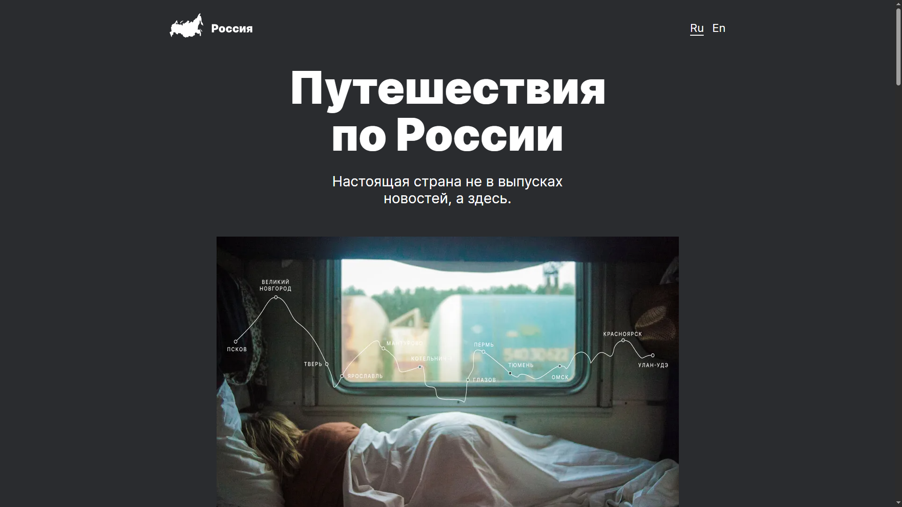

# Проект "Путешествия по России" – Адаптивный одностраничный лендинг

## О проекте

Проект представляет собой одностраничный адаптивный лендинг на тему путешествий по России. Сайт создан для демонстрации современных подходов к вёрстке: он адаптирован под различные устройства, имеет чистую и логичную структуру, а также оптимизированные изображения.  

Проект выполнен в рамках второго спринта курса **"Веб-разработчик +"**, 16-я когорта.

## Превью проекта



## Ссылка на демо

- [Посмотреть сайт](https://russian-travel-five.vercel.app/)

## Статус проекта

Проект завершён.

## Функциональность

- **Адаптивная вёрстка**: Корректное отображение на экранах от 340px до 1280px и выше.
- **Семантическая разметка**: Используются теги `<header>`, `<main>`, `<section>`, `<footer>` и др.
- **Flexbox и Grid Layout**: Используются для построения сеток и позиционирования элементов.
- **Позиционирование**: Применено как относительное, так и абсолютное позиционирование.
- **БЭМ-структура**: Именование классов по методологии БЭМ для лучшей читаемости и поддержки.
- **Оптимизация изображений**: Добавлены форматы `.webp`, поддержка Retina-дисплеев, уменьшен вес изображений.

## Технологии и инструменты

- **HTML5** — Семантическая и структурированная разметка.
- **CSS3** — Адаптивные стили и базовые анимации.
- **Flexbox и CSS Grid** — Гибкое построение макета.
- **Методология БЭМ** — Чистота и масштабируемость кода.
- **Медиа-запросы** — Точки перелома: `1280px`, `1024px`, `768px`, `340px`.
- **Оптимизация изображений** — Сжатие, `.webp`, Retina-ready.

## Как запустить проект локально

1. Клонируйте репозиторий:

   ```bash
   git clone https://github.com/kirill-io/russian-travel.git

2. Перейдите в папку проекта:

    ```bash
    cd russian-travel

3. Откройте файл index.html в браузере или используйте расширение Live Server в редакторе кода (например, VS Code).
  
